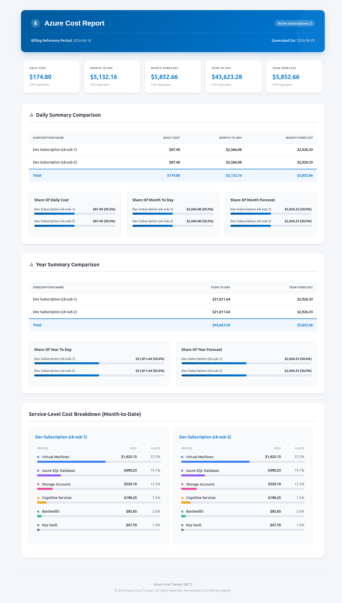

# AzureCostTracker - ACT

**Azure Cost Tracker** (ACT) is a professional cost management and reporting utility. It tracks **Azure subscription costs**, generates a **unified HTML report** (live dashboard, email, and PDF), compiles **PDF attachments** using WeasyPrint, and sends notifications via **email** or **webhooks** (Slack, MS Teams, etc.).

### 📊 Feature Preview:
</img>

---

## 🌟 Upgraded Features

* **Dual-Mode Execution**:
  * 🌐 **Server Mode (`--server`)**: Launches a local FastAPI server at `http://localhost:8000` with an interactive dashboard (control bar for refresh, email, PDF download, and webhook). Uses thread-safe in-memory caching.
  * 🖥️ **CI/CD Mode (Default)**: Runs headless. Fetches billing data, renders the report, generates a PDF, sends notifications, and exits. Temp files are cleaned up automatically.
  * 👁️ **Preview Mode (`--preview`)**: Writes `output/preview.html` and opens it in your default browser.
* **Unified Report View**: One Jinja2 template powers the live dashboard, email body, and PDF attachment. The dashboard adds a control bar only — all other content is identical.
* 📄 **Automated PDF Export**: Compiles reports into printable PDF attachments via **WeasyPrint** (`GET /api/download/pdf` on the dashboard).
* 💱 **Dynamic Billing Currency**: Detects billing currency (e.g. `USD`, `CAD`, `EUR`, `INR`) from Azure and maps symbols (`$`, `€`, `£`, `₹`) across tables, cards, bars, and webhooks.
* **Modular Template Architecture**: Report layout split into reusable components under `templates/components/`.
* **Email-Client Compatible Layouts**: Inline tables and **table-based horizontal bars** for service breakdowns — reliable in Gmail, Outlook, PDF, and the browser (no SVG or Chart.js).

---

## 📂 Project Structure

```
azure-cost-tracker/
│── src/
│   ├── main.py                        # CLI entrypoint (CI/CD, preview, server)
│   ├── app.py                         # FastAPI dashboard and API endpoints
│   ├── config.py                      # .env configuration and subscription list
│   ├── services/
│   │   ├── azure_auth.py              # Access token (includes mock mode)
│   │   ├── azure_billing.py           # Billing period cache and date helpers
│   │   ├── azure_cost.py              # Throttled Cost Management API client
│   │   ├── azure_cost_scope.py        # Management Group scoped queries (optional)
│   │   ├── cost_aggregator.py         # Derive MTD/YTD/breakdown from Daily rows
│   │   ├── email_service.py           # SMTP HTML email with attachments
│   │   ├── html_renderer.py           # Backward-compatible render/PDF wrappers
│   │   ├── webhook_service.py         # Markdown webhook notifications
│   │   └── report/                    # Unified report rendering (OOP layer)
│   │       ├── renderer.py            # ReportRenderer (Jinja2)
│   │       ├── pdf_exporter.py        # WeasyPrint PDF export
│   │       ├── modes.py               # INTERACTIVE vs STATIC report modes
│   │       └── constants.py           # Chart colors, paths
│   └── utils/
│       ├── logger.py
│       └── utils.py                   # Cost math, formatting, currency symbols
│── templates/
│   ├── report_template.html           # Main layout skeleton
│   └── components/
│       ├── control_bar.html           # Dashboard actions (interactive mode only)
│       ├── header.html
│       ├── summary_cards.html
│       ├── comparison_tables.html   # Subscription tables & share bars
│       ├── service_breakdown.html   # MTD breakdown with horizontal bars
│       ├── macros.html                # Shared Jinja macros (colors, bars)
│       ├── styles.html
│       ├── scripts.html
│       └── footer.html
│── tests/
│   ├── test_act_utils.py
│   ├── test_services.py
│   ├── test_report_renderer.py
│   ├── test_e2e_regression.py
│   ├── test_cost_aggregator.py
│   └── test_rate_limit.py
│── output/                            # Previews and temp PDFs (git ignored)
│── .env
│── requirement.txt
│── setup.py
│── README.md
```

---

## 🔧 Setup Instructions

### 1️⃣ Clone the Repository
```bash
git clone https://github.com/interittus13/AzureCostTracker
cd AzureCostTracker
```

### 2️⃣ Create Virtual Environment & Install Dependencies
```bash
python3 -m venv .venv
source .venv/bin/activate   # Linux / macOS
# .venv\Scripts\activate    # Windows
pip install -r requirement.txt
```

**PDF generation (WeasyPrint)** requires system libraries on Linux:
```bash
sudo apt-get install -y libpango-1.0-0 libpangocairo-1.0-0 libgdk-pixbuf2.0-0 libcairo2
```

### 3️⃣ Configure Environment
Create a `.env` file in the root directory:
```env
TENANT_ID=your-azure-tenant-id
CLIENT_ID=your-azure-client-id
CLIENT_SECRET=your-azure-client-secret
SUBSCRIPTION_IDS=subscription-id1,subscription-id2

# Notification settings
EMAIL_FROM=your-email@example.com
EMAIL_TO=recipient1@example.com,recipient2@example.com
SMTP_SERVER=smtp.office365.com
SMTP_PORT=587
SMTP_PASS=your-smtp-password

WEBHOOK_URL=https://your-teams-webhook-url
NOTIFY_METHOD=email  # Options: email, webhook, both
MOCK_AZURE=true       # Set to true for local dev without Azure credentials

# Rate limiting (optional — reduces Azure 429 errors)
COST_API_MAX_CONCURRENT=1
COST_API_MIN_INTERVAL_SEC=2
BILLING_START_DAY=1   # Skip Billing API; use calendar month starting on this day

# Management Group scope (optional Phase 2 — 2 API calls for all subscriptions)
# COST_SCOPE=managementGroup
# MANAGEMENT_GROUP_ID=your-management-group-id
```

---

## ⚡ Rate Limiting & Troubleshooting

Azure Cost Management returns **HTTP 429** when too many queries run in parallel. ACT reduces burst traffic by:

1. **Consolidated queries** — two Cost API calls per subscription (one Daily actual query for the full year, one forecast query) instead of five.
2. **Sequential subscriptions** — subscriptions are processed one at a time by default.
3. **Global throttling** — `COST_API_MAX_CONCURRENT` and optional `COST_API_MIN_INTERVAL_SEC` gate every cost API request.

| Variable | Default | Purpose |
|----------|---------|---------|
| `COST_API_MAX_CONCURRENT` | `1` | Max simultaneous Cost Management API requests |
| `COST_API_MIN_INTERVAL_SEC` | `0` | Minimum seconds between requests (e.g. `2`) |
| `BILLING_START_DAY` | *(unset)* | Fixed billing start day; skips Billing API when set |
| `COST_SCOPE` | `subscription` | Set to `managementGroup` for MG-scoped queries |
| `MANAGEMENT_GROUP_ID` | *(unset)* | Required when `COST_SCOPE=managementGroup` |

**If you still see 429 retries:** increase `COST_API_MIN_INTERVAL_SEC`, keep `COST_API_MAX_CONCURRENT=1`, and avoid rapid dashboard **Refresh** clicks. For 10+ subscriptions with MG-level RBAC, enable `COST_SCOPE=managementGroup`.

---

## 🚀 Execution Guide

Activate the virtual environment before every run:

```bash
source .venv/bin/activate   # Linux / macOS
# .venv\Scripts\activate    # Windows
```

If you have not set up the venv yet, see [Setup Instructions](#-setup-instructions) first.

### 1. Headless CI/CD Mode (Default)
For cron jobs or GitHub Actions:
```bash
python -m src.main
```
Fetches billing data, renders the report, attaches the PDF to email (when `NOTIFY_METHOD=email`), and exits.

### 2. Developer Static Preview
Write `output/preview.html` and open it in the browser:
```bash
python -m src.main --preview
```

### 3. Launch Interactive Dashboard Server
```bash
python -m src.main --server
```
Open `http://localhost:8000`. Available actions:

| Action | Description |
|--------|-------------|
| **Refresh Cost Data** | Clears cache and re-fetches from Azure |
| **Send Email Report** | Background email with same HTML + PDF attachment |
| **Download PDF** | Generates and downloads the current report |
| **Send Webhook** | Posts a Markdown summary to `WEBHOOK_URL` |

### 4. Run Verification Tests
```bash
python -m pytest tests/ -v
```

Includes unit tests, SMTP/webhook mocks, renderer tests, and E2E regression (`tests/test_e2e_regression.py`) covering mock data fetch → render → PDF → FastAPI endpoints → CLI email flow.

---

## 📡 Webhook Setup
1. Go to **Microsoft Teams** / **Slack** → **Your Channel** → Create an **Incoming Webhook**.
2. Copy the generated Webhook URL and paste it in `.env` under `WEBHOOK_URL`.
3. Webhook alerts deliver a formatted Markdown cost summary (separate from the HTML report).

---

## 📜 License
This project is open-source under the **MIT License**.
